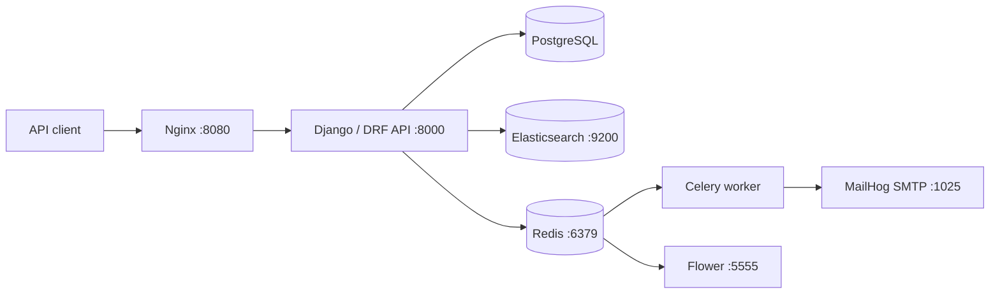
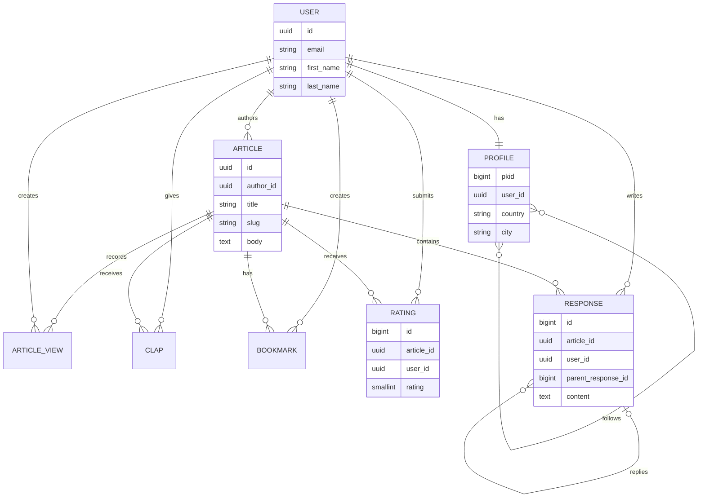
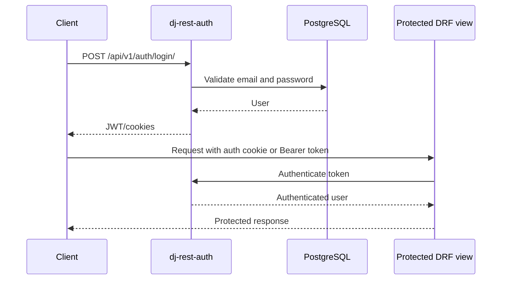
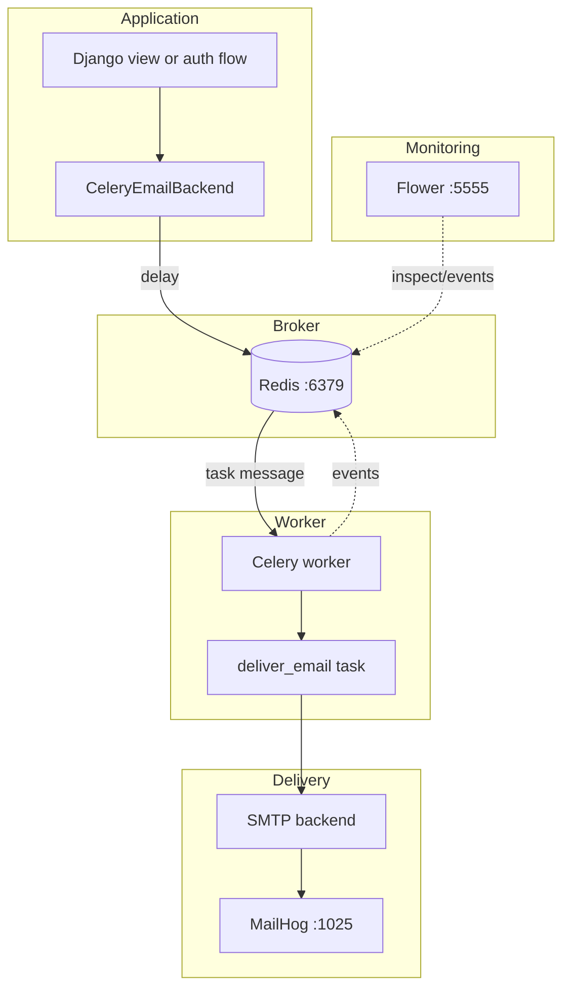
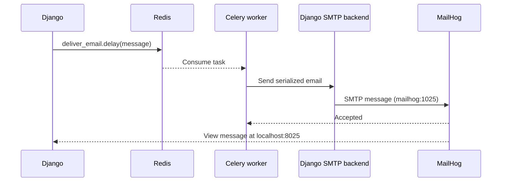
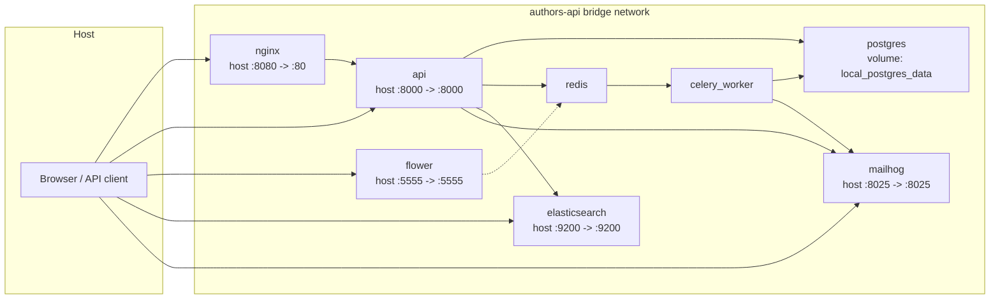
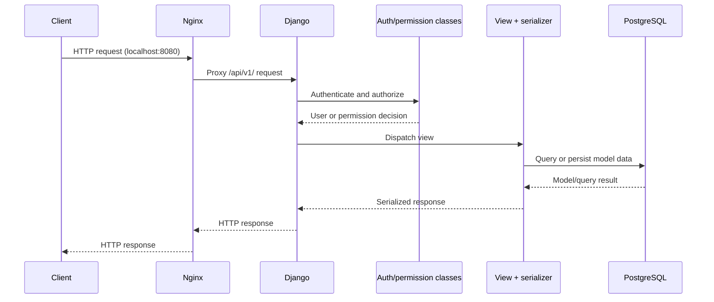
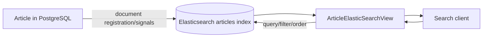

# Article Publishing Platform API

> A Django REST Framework API for publishing, discovering, and discussing articles.

[](https://www.python.org/)
[](https://www.djangoproject.com/)
[](https://www.django-rest-framework.org/)
[](https://docs.celeryq.dev/)
[](https://redis.io/)
[](https://flower.readthedocs.io/)
[](https://github.com/mailhog/MailHog)
[](https://nginx.org/)
[](https://www.elastic.co/elasticsearch)
[](https://docs.docker.com/compose/)


This repository contains the backend for an article publishing platform. Authenticated users can publish and manage articles, follow profiles, bookmark and clap for articles, rate and respond to content, and search the article index.

Repository: <https://github.com/hima97u/article-publishing-platform-api>

## Contents

- [Overview](#overview)
- [Features](#features)
- [Technology stack](#technology-stack)
- [Architecture](#architecture)
- [Repository structure](#repository-structure)
- [API reference](#api-reference)
- [Data model](#data-model)
- [Authentication](#authentication)
- [Background tasks and email](#background-tasks-and-email)
- [Docker Compose services](#docker-compose-services)
- [Request lifecycle](#request-lifecycle)
- [Search](#search)
- [Local setup](#local-setup)
- [Useful commands](#useful-commands)
- [Environment variables](#environment-variables)
- [Testing and code quality](#testing-and-code-quality)
- [Troubleshooting](#troubleshooting)
- [Security and production considerations](#security-and-production-considerations)
- [Contributing and license](#contributing-and-license)

## Overview

The API is organized as a Django project (`authors_api`) and a set of domain applications under `core_apps`:

- custom email-based users and profile/follow relationships;
- article creation, updates, deletion, tags, read-time estimates, views, claps, ratings, bookmarks, and nested responses;
- JWT authentication through `dj-rest-auth` and `djangorestframework-simplejwt`;
- asynchronous email delivery through Celery and Redis;
- Elasticsearch-backed article search;
- OpenAPI/ReDoc documentation at `/redoc/`;
- a Docker Compose development environment with Nginx serving static and media files.

The project is useful for exploring a modular DRF codebase, custom user models, ownership permissions, asynchronous email delivery, search indexing, and multi-service local development.

## Features

### API

- Email-based registration and authentication.
- Profile listing, profile updates, following, unfollowing, and follower listing.
- Authenticated article CRUD with multipart image uploads.
- Article tags, estimated reading time, view recording, claps, ratings, bookmarks, and nested responses.
- Pagination, article ordering/filtering, and Elasticsearch search.
- Django admin at the configured `ADMIN_URL`.
- ReDoc API documentation.

### Infrastructure and operations

- PostgreSQL with a persistent Docker volume.
- Redis 7 as the Celery broker and result backend.
- Celery worker with task events enabled.
- Flower monitoring protected by basic authentication.
- MailHog SMTP capture for local email inspection.
- Elasticsearch 8.10.2 with the `articles` index.
- Nginx reverse proxy and static/media file serving.

## Technology stack

| Technology | Purpose | Where it is used |
| --- | --- | --- |
| Python 3.11 target | Runtime/tooling target | `pyproject.toml` Black configuration |
| Django 6.1 | Web framework, ORM, admin, migrations | `authors_api`, `core_apps` |
| Django REST Framework 3.18 | API views, serializers, authentication integration | All API applications |
| PostgreSQL | Primary relational database | `authors_api/settings/base.py`, `local.yml` |
| Simple JWT and `dj-rest-auth` | JWT authentication and auth endpoints | `authors_api/settings/base.py`, `authors_api/urls.py` |
| django-allauth | Email-based account registration and verification | `authors_api/settings/base.py` |
| Celery 5.6 and Redis 7 | Asynchronous task execution and broker/backend | `authors_api/celery.py`, `core_apps/common` |
| Flower | Celery worker/task monitoring | `local.yml`, `docker/local/django/celery/flower/start` |
| Elasticsearch 8.10.2 | Article indexing and search | `core_apps/search`, `local.yml` |
| Nginx | Reverse proxy and static/media serving | `docker/local/nginx` |
| MailHog | Local SMTP capture | `local.yml` |
| Docker Compose | Reproducible local service stack | `local.yml`, `makefile` |
| pytest-django | Test runner configuration | `pyproject.toml`, `requirements/local.txt` |
| Black, isort, flake8 | Formatting/import/lint checks | `pyproject.toml`, `setup.cfg` |

## Architecture

The local deployment separates synchronous HTTP traffic, relational persistence, search, and asynchronous work:



- **API** handles authentication, validation, permissions, ORM operations, and search requests.
- **PostgreSQL** stores users, profiles, articles, tags, ratings, bookmarks, responses, claps, and views.
- **Elasticsearch** stores the searchable `articles` document index.
- **Redis** is configured as both `CELERY_BROKER_URL` and `CELERY_RESULT_BACKEND`.
- **Celery worker** consumes queued tasks; the verified task is asynchronous email delivery.
- **Flower** observes Celery events; it is not a worker and does not execute application tasks.
- **Nginx** proxies API/admin/ReDoc requests and serves static/media volumes.

## Repository structure

```text
.
├── authors_api/
│   ├── settings/{base,local,production}.py
│   ├── urls.py
│   └── celery.py
├── core_apps/
│   ├── articles/       # Article CRUD, tags, claps, views
│   ├── bookmarks/      # Bookmark endpoints
│   ├── common/         # Shared email backend and Celery task
│   ├── profiles/       # Profiles and follow relationships
│   ├── ratings/        # Article ratings
│   ├── responses/      # Article responses and replies
│   ├── search/         # Elasticsearch document and view
│   └── users/          # Custom user and registration serializer
├── docker/local/
│   ├── django/         # API image and startup scripts
│   ├── nginx/          # Reverse proxy image/configuration
│   └── postgres/       # PostgreSQL image and maintenance scripts
├── requirements/
├── local.yml
├── makefile
├── manage.py
├── pyproject.toml
└── setup.cfg
```

Migrations are kept inside each application. Virtual environments, caches, generated static files, media files, and secret values are intentionally not part of this documented tree.

## API reference

All application routes use the `/api/v1/` prefix. The default DRF permission is `IsAuthenticated`; search and profile listing explicitly allow public access where configured.

### Authentication and account routes

`dj-rest-auth` supplies the standard login/logout/password endpoints, and allauth supplies registration:

| Method | Endpoint | Purpose | Authentication |
| --- | --- | --- | --- |
| POST | `/api/v1/auth/login/` | Log in | Public |
| POST | `/api/v1/auth/logout/` | Log out | Authenticated |
| GET/PUT/PATCH | `/api/v1/auth/user` | Current user details | Authenticated |
| POST | `/api/v1/auth/registration/` | Register with email, name, and password confirmation | Public |
| POST | `/api/v1/auth/password/reset/` | Request a password reset | Public |
| POST | `/api/v1/auth/password/reset/confirm/<uidb64>/<token>/` | Complete a password reset | Public with reset token |

Email verification is configured as mandatory. Exact serializer responses are exposed through ReDoc.

### Profiles

| Method | Endpoint | Purpose | Authentication |
| --- | --- | --- | --- |
| GET | `/api/v1/profiles/all/` | Paginated profile list | Public |
| GET | `/api/v1/profiles/me/` | Current user profile | Authenticated |
| PATCH | `/api/v1/profiles/me/update/` | Update profile fields; multipart parsing is enabled | Authenticated |
| GET | `/api/v1/profiles/me/followers/` | Current follower list and count | Authenticated |
| POST | `/api/v1/profiles/<user_id>/follow/` | Follow a user | View does not declare a permission class; authenticate in normal use |
| POST | `/api/v1/profiles/<user_id>/unfollow/` | Unfollow a user | View does not declare a permission class; authenticate in normal use |

### Articles

| Method | Endpoint | Purpose | Authentication |
| --- | --- | --- | --- |
| GET | `/api/v1/articles/` | Paginated article list | Authenticated |
| POST | `/api/v1/articles/` | Create an article; author is the current user | Authenticated |
| GET | `/api/v1/articles/<id>/` | Retrieve an article and record a view | Authenticated |
| PUT/PATCH | `/api/v1/articles/<id>/` | Update an article | Authenticated owner |
| DELETE | `/api/v1/articles/<id>/` | Delete an article | Authenticated owner |
| POST | `/api/v1/articles/<article_id>/clap/` | Clap once for an article | Authenticated in normal use |
| DELETE | `/api/v1/articles/<article_id>/clap/` | Remove the current user’s clap | Authenticated in normal use |

Article creation/update uses fields such as `title`, `description`, `body`, `tags` (a list), and `banner_image`. Responses include author information, view/clap/bookmark counts, ratings, nested responses, timestamps, slug, and estimated reading time. Article list ordering supports `created_at` and `updated_at`; the filter set is defined in `core_apps/articles/filters.py`.

### Ratings, bookmarks, and responses

| Method | Endpoint | Purpose | Authentication |
| --- | --- | --- | --- |
| POST | `/api/v1/ratings/rate_article/<article_id>/` | Rate an article, with an optional review | Authenticated |
| POST | `/api/v1/bookmarks/bookmark_article/<article_id>/` | Bookmark an article | Authenticated |
| DELETE | `/api/v1/bookmarks/remove_bookmark/<article_id>/` | Remove the current user’s bookmark | Authenticated |
| GET/POST | `/api/v1/responses/article/<article_id>/` | List top-level responses or create one | Authenticated |
| GET/PUT/PATCH/DELETE | `/api/v1/responses/<id>/` | Retrieve/update/delete a response | Update/delete by its author |

Ratings and bookmarks are unique per user/article. Responses support a `parent_response` relationship for replies.

### Search and documentation

| Method | Endpoint | Purpose | Authentication |
| --- | --- | --- | --- |
| GET | `/api/v1/search/` | Search the Elasticsearch article document | Public |
| GET | `/api/v1/search/search/` | Legacy alias for article search | Public |
| GET | `/redoc/` | ReDoc-generated API documentation | Public |

Search fields include title, description, body, author first/last name, and tags. Supported filtering/order fields are defined in `core_apps/search/views.py`; ordering defaults to newest `created_at` first.

## Data model

The primary key exposed by the custom `User` model is a UUID field (`id`); it also retains an internal `pkid` field. Timestamps come from the shared `TimeStampedModel` where applicable.



Unique constraints prevent duplicate claps, bookmarks, and ratings for the same user/article pair. `ArticleView` uses article, user, and viewer IP to avoid duplicate view records.

## Authentication

The API uses `dj-rest-auth` with Simple JWT and cookie authentication. The configured access lifetime is 30 minutes, refresh lifetime is one day, refresh tokens rotate, and the configured cookies are `authors-access-token` and `authors-refresh-token`. The project also sets the JWT header type to `Bearer`.



Registration requires email, first name, last name, password, and password confirmation. Email verification is mandatory. Use the generated ReDoc schema for the exact auth response shapes.

## Background tasks and email

The local settings use `CeleryEmailBackend`. Sending an email serializes the message and calls `deliver_email.delay(...)`; the worker then sends it through Django’s SMTP backend. Redis is both the broker and result backend. The task retries `OSError` failures with exponential backoff up to five retries.



Flower monitors workers and task events; it does not consume and execute the email task. Open <http://localhost:5555> with the configured Flower credentials to inspect the local worker. MailHog’s web UI is at <http://localhost:8025>.

### Email delivery flow

The local email path is asynchronous: Django queues a serialized message, Celery sends it through Django’s SMTP backend, and MailHog captures it for inspection.



## Docker Compose services

`local.yml` defines one `authors-api` bridge network and the following services:

| Service | Responsibility | Container port | Host port | Dependencies / volumes |
| --- | --- | ---: | ---: | --- |
| `api` | Django development server | 8000 | 8000 | PostgreSQL, Redis, MailHog, Elasticsearch; static/media volumes |
| `postgres` | Relational database | 5432 | Not published | PostgreSQL data and backup volumes |
| `redis` | Celery broker/result backend | 6379 | Not published | Health check with `redis-cli ping` |
| `celery_worker` | Celery task consumer | N/A | N/A | Redis, PostgreSQL, MailHog |
| `flower` | Celery monitoring UI | 5555 | 5555 | Redis, PostgreSQL; `flower_data` |
| `elasticsearch` | Article search index | 9200 | 9200 | Single-node, security disabled locally |
| `mailhog` | Local SMTP capture/UI | 1025/8025 | 8025 (UI) | SMTP is reached internally at `mailhog:1025` |
| `nginx` | Reverse proxy and static/media server | 80 | 8080 | API; static/media volumes |



PostgreSQL, Redis, MailHog, and Elasticsearch are reached by Compose service name inside the network. Only the ports shown in the host-port column are published to the host.

## Request lifecycle



The API is also published directly on `http://localhost:8000`; Nginx is required for the local reverse-proxy/static/media path on port 8080.

## Search

`ArticleDocument` indexes article title, description, body, author names, tags, and `created_at` into the `articles` index. Django signals register the document, while `django-elasticsearch-dsl` management commands are available through the Makefile.



The repository does not include an Elasticsearch service in production settings; the Compose Elasticsearch service is the verified local configuration. Create or rebuild the local index with the commands below.

## Local setup

### Prerequisites

- Docker Desktop with the Compose plugin.
- Git.
- For non-container development: Python matching the project’s Python 3.11 tooling target and PostgreSQL, Redis, and Elasticsearch services.

### Start the supported local stack

```powershell
git clone https://github.com/hima97u/article-publishing-platform-api.git
cd article-publishing-platform-api
docker compose -f local.yml up --build -d --remove-orphans
docker compose -f local.yml run --rm api python manage.py migrate
docker compose -f local.yml run --rm api python manage.py search_index --create
docker compose -f local.yml run --rm api python manage.py search_index --populate
```

The Compose file loads `.envs/.local/.django` and `.envs/.local/.postgres`. These files contain local configuration and secrets in the current checkout; do not publish their values. For a new environment, create them with the variable names in [Environment variables](#environment-variables), using new local credentials.

The API is available at <http://localhost:8000> and through Nginx at <http://localhost:8080>. ReDoc is available at <http://localhost:8080/redoc/> and admin is under the configured `ADMIN_URL`.

Create an administrator when needed:

```powershell
docker compose -f local.yml run --rm api python manage.py createsuperuser
```

## Useful commands

The Makefile wraps the project’s Compose commands:

```powershell
make build             # Build and start the stack
make up                # Start existing images
make down              # Stop and remove containers
make show-logs         # Show all service logs
make show-logs-api     # Show API logs
make migrate           # Apply migrations
make makemigrations    # Create migrations
make collectstatic     # Collect static files
make superuser         # Create an admin user
make createIndex       # Create the Elasticsearch index
make populateIndex     # Populate the Elasticsearch index
make rebuildIndex      # Rebuild the Elasticsearch index
make flake8            # Run flake8 in the API container
make black-check       # Check Black formatting
make isort-check       # Check import ordering
```

Equivalent commands that are useful on Windows when `make` is unavailable:

```powershell
docker compose -f local.yml logs -f api
docker compose -f local.yml logs -f celery_worker
docker compose -f local.yml ps
docker compose -f local.yml exec api python manage.py shell
docker compose -f local.yml exec api flake8 .
docker compose -f local.yml exec api black --check --exclude=migrations .
docker compose -f local.yml exec api isort . --check-only --skip venv --skip migrations
docker compose -f local.yml down
```

`docker compose -f local.yml down -v` removes named volumes and is intentionally not part of the routine workflow because it deletes local database data.

## Environment variables

Values below are safe examples, not credentials. The Compose files also provide fixed service-to-service defaults in `local.yml` and the settings modules.

| Variable | Purpose | Required? | Safe example |
| --- | --- | --- | --- |
| `DJANGO_DEBUG` | Base settings debug flag | Yes for explicit behavior | `True` locally |
| `DJANGO_SECRET_KEY` | Django signing/crypto secret | Yes outside the local fallback | `<generate-a-unique-secret>` |
| `SIGNING_KEY` | Simple JWT signing key | Yes | `<generate-a-unique-key>` |
| `POSTGRES_HOST` | Database service hostname | Yes | `postgres` |
| `POSTGRES_PORT` | Database port | Yes | `5432` |
| `POSTGRES_DB` | Database name | Yes | `authors-live` |
| `POSTGRES_USER` | Database username | Yes | `<local-db-user>` |
| `POSTGRES_PASSWORD` | Database password | Yes | `<local-db-password>` |
| `DATABASE_URL` | Entrypoint-computed database URL | Derived | `<not-committed>` |
| `CELERY_BROKER` | Redis broker URL | Yes | `redis://redis:6379/0` |
| `EMAIL_HOST` | SMTP service hostname | Local default | `mailhog` |
| `EMAIL_PORT` | SMTP service port | Yes for local email | `1025` |
| `DEFAULT_FROM_EMAIL` | Default sender | No; local default exists | `noreply@example.test` |
| `DOMAIN` | Site/domain value used by local settings | Yes for configured email flows | `localhost:8080` |
| `ELASTICSEARCH_HOST` | Elasticsearch endpoint | No; local default exists | `elasticsearch:9200` |
| `CELERY_FLOWER_USER` | Flower basic-auth username | Yes for the startup script | `<flower-user>` |
| `CELERY_FLOWER_PASSWORD` | Flower basic-auth password | Yes for the startup script | `<flower-password>` |

Generate production secrets with a secret manager or a cryptographically secure generator. Never reuse the values from a local environment file.

## Testing and code quality

The repository uses pytest-django. Test discovery is configured for `core_apps` and `authors_api` in `pyproject.toml`; the current application test modules are largely scaffolding, so do not infer broad coverage from the presence of the test runner.

```powershell
docker compose -f local.yml run --rm api pytest
docker compose -f local.yml exec api flake8 .
docker compose -f local.yml exec api black --check --exclude=migrations .
docker compose -f local.yml exec api isort . --check-only --skip venv --skip migrations
```

## Troubleshooting

- **Database connection fails:** check `docker compose -f local.yml ps`, `docker compose -f local.yml logs postgres`, and the `POSTGRES_*` values. The API and entrypoint wait for PostgreSQL health/readiness.
- **Migrations fail:** inspect API logs, then run `docker compose -f local.yml run --rm api python manage.py migrate`.
- **Celery receives no work:** verify Redis health and follow `docker compose -f local.yml logs -f celery_worker`. Confirm `CELERY_BROKER` uses the internal hostname `redis`.
- **Flower shows no worker:** check the worker logs and confirm both worker and Flower use the same Redis broker. Flower is exposed at port 5555 and requires basic authentication.
- **Emails are not visible:** check `docker compose -f local.yml logs celery_worker`, then open <http://localhost:8025>. Internal SMTP is `mailhog:1025`.
- **Elasticsearch search fails:** inspect `docker compose -f local.yml logs elasticsearch`, check <http://localhost:9200>, and rebuild with `make rebuildIndex`.
- **Port conflict:** change the host side of the published mapping in `local.yml` (for example `8081:80`) and use the new host port.
- **Static/media files are missing:** run `make collectstatic`, ensure Nginx is running, and check the shared `static_volume` and `media_volume`.
- **Configuration appears ignored:** confirm the environment files are mounted by `local.yml` and that variable names match the settings modules exactly.

## Security and production considerations

The local settings intentionally enable development conveniences: `DEBUG = True`, Elasticsearch security is disabled in Compose, MailHog is used for SMTP capture, and Flower is locally published. Before deployment:

- use `authors_api.settings.production` only after completing its TODOs and configuring a real `CSRF_TRUSTED_ORIGINS`;
- provide strong, unique `DJANGO_SECRET_KEY` and `SIGNING_KEY` values through a secret manager;
- set explicit allowed hosts, CORS, CSRF, secure-cookie, and HTTPS/reverse-proxy settings;
- do not publish PostgreSQL or Redis directly, and restrict Flower access;
- enable Elasticsearch authentication/TLS if it is deployed;
- configure a real SMTP provider and verify email delivery/retry behavior;
- use TLS at the edge, encrypted backups, database backup retention, and structured log/health monitoring;
- review ownership permissions and authentication on every exposed endpoint before production rollout.

## Contributing and license

For changes, create a focused branch, update or add tests where behavior changes, run the formatting/lint/test commands above, and describe operational impacts in the pull request. Keep credentials and generated files out of commits.

No license file is present in the repository snapshot. The API metadata names an MIT license, but that metadata is not a substitute for a repository license file; confirm the intended licensing terms with the maintainers before redistributing the code.

---

This README documents the verified local Django/DRF implementation and its Compose services. See the [repository](https://github.com/hima97u/article-publishing-platform-api) for source changes and issue tracking.
